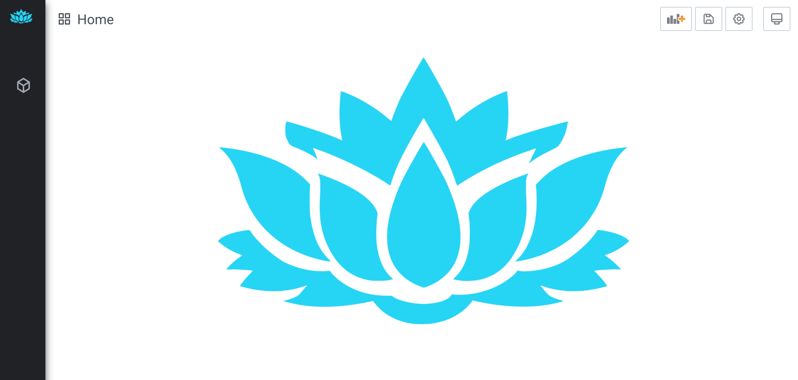
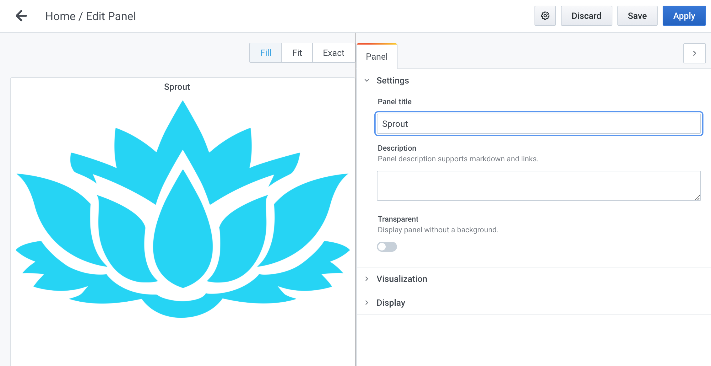

# sprout-platform  

This project provides a CMS application as a Spring Boot Starter library.  
It can be used headless, but a default UI is provided which is customizable via plugins.  

The front-end UI uses a `plugin` system to add or modify functionality.  
[Read more about the front-end](./frontend/)  

The back-end server uses a `module` system to add or modify functionality. A `module` may also provide `plugins` to the UI.  
[Read more about the back-end](./backend/)  


The platform has gone through several iterations - AngularJS, Angular 2/4/6, and now React.  
I got lots of inspiration [and code] from the Grafana UI + toolkit for this latest iteration.  

I'd love to get some input from the community!  

If there is specific feature you'd like, or if you experience a bug, please open an issue [here](https://github.com/savantly-net/sprout-platform/issues)  

Please consider contributing through PRs or [Patreon](https://www.patreon.com/savantly)  

I believe the Open Source community needs an enterprise grade CMS that's flexible enough for any project starter.  
Help me create that! 

[](https://paypal.me/Savantly)  

Sprout platform is currently being refactored to leverage the latest libraries and practices. 
The development branch may be unstable until this is complete.  
Follow this project to stay informed.  

[](https://travis-ci.org/savantly-net/sprout-platform)  master

[](https://travis-ci.org/savantly-net/sprout-platform)  development

## Quick Start  

Use the docker images to start an example server + web app.  
`docker-compose up`  

## Examples

  


  


  


## Development 
If you're a Java, React, or Grafana developer, you'll be familiar with the tooling. 

The UI was bootstrapped using `create-react-app`  
The backend uses `gradle` + `Spring Boot`  

The component library is made of general React components that can be used in your own React application.  
`npm install @sprout-platform/ui`  
Storybook is used to document and demo the UI component library.  
It's published [here](https://master--5f96ec613d800900227e3b76.chromatic.com)  

To get started developing Sprout -  
- Clone this project 
- Run `./gradlew :server:bootRun` from the base directory of the project to start the server 
- Open http://localhost:8080/admin to access the backend application  

You can override properties by modifying the `application.properties`    
[See here for more info.](./starters/sprout-spring-boot-starter/src/main/resources/)  

The backend server is developed as a `Spring Boot Starter` so it can be added to any Spring app to bootstrap with defaults.  
It's not production ready yet, but should be by Q1 2021.  

The main backend code is located in the Sprout Starter project.  
Read more about the [Sprout Starter](./backend/starters/sprout-spring-boot-starter)

The front-end uses the [Rush Stack](https://rushstack.io/) for build orchestration. [./frontend/apps/webapp](./frontend/apps/webapp)  
You can install rush from the project script -  
`./common/scripts/install-run-rush`  

To build the front-end -  
```bash
# from the project root
rush update
rush build
```

To start the front-end app -  
```bash
rush start
``` 

To add a dependency to a front-end project - 
```bash
cd ./frontend/<project sub dir>
rush add -p @scoped/package
```


The toolkit from Grafana has been used to setup the dependencies.  
It doesn't support all the same features as Grafana, and the plugin bootstrapping is still progress.  


## UI Port from Grafana 
First - Many thanks to the Grafana developers, who have put tremendous effort into the UI and plugin toolkit.  

The port from Grafana UI went like this - 
- Copy the UI project into my workspace
- Rip all the time-series related stuff out [woah!!!] =)
- Rip all the Angular stuff out [oh man... so many red squiggly lines in my IDE]
- Rip half my hair out
- Rip out cool features that I don't have time to port right now =(
- Monkey patch about 200 files
- Rip the other half of my hair out
- Connect the 'home' dashboard request to the server, and provide some mock data
- Build some docker images. woohoo!


## TODO
This list is not comprehensive, but some high level tasks I'd like to tackle soon. 

- [ ] Add a code editor to the Standard Editors [port Monaco stuff from Grafana?]
- [ ] Add Authentication screens to UI
- [ ] Add lots of tests
- [ ] Add server hook for all the boot data the UI expects [in progress]
