  master

  development

# sprout-platform  

If this project helps you, feel free to buy me a cup of coffee so I can program longer! =]  

  

Sprout platform is an opinionated collection of libraries to make rapid development of Spring+Java web applications easier  

#### Check out the [Demo App](https://sprout-garden.herokuapp.com/)

### Must see projects  

[Garden App]
A full featured application based on the Sprout platform that contains all the official plugins.   

[sprout-spring-boot-starter]
A Spring-Boot starter that provides a full server/client framework for rapidly developing prototypes.
  
  
### Quick Start Installation  
Download the latest [release], and start it from the command line -  
`java -jar garden.jar`  

You can override properties by including a `application.properties` file in the same directory as the jar file.  
[See here for more info.](./src/main/resources/)  

### Development   
[Requires nodejs]  
- Branch the [Garden App]
- Run `mvn spring-boot:run` from the base directory of the project  
- Open http://localhost:8080 in the browser to access the application
- Open http://localhost:8080/admin to access the application administration

#### Home Page  
Customizable landing page for your visitors
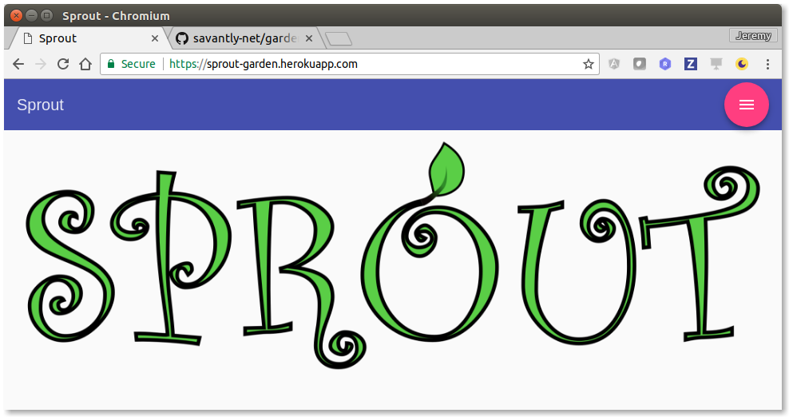  

#### Admin Page  
Manage your Sprout application here  
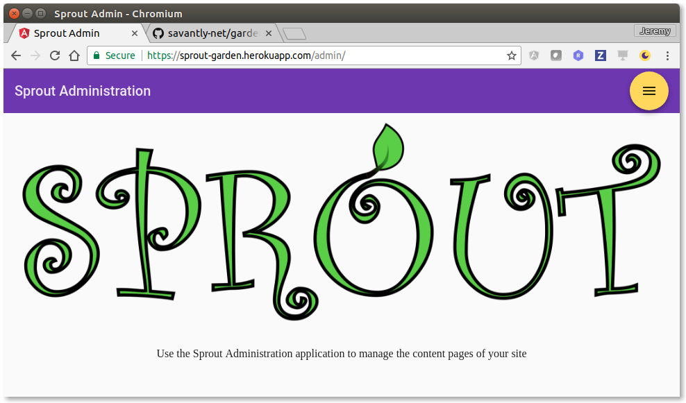  
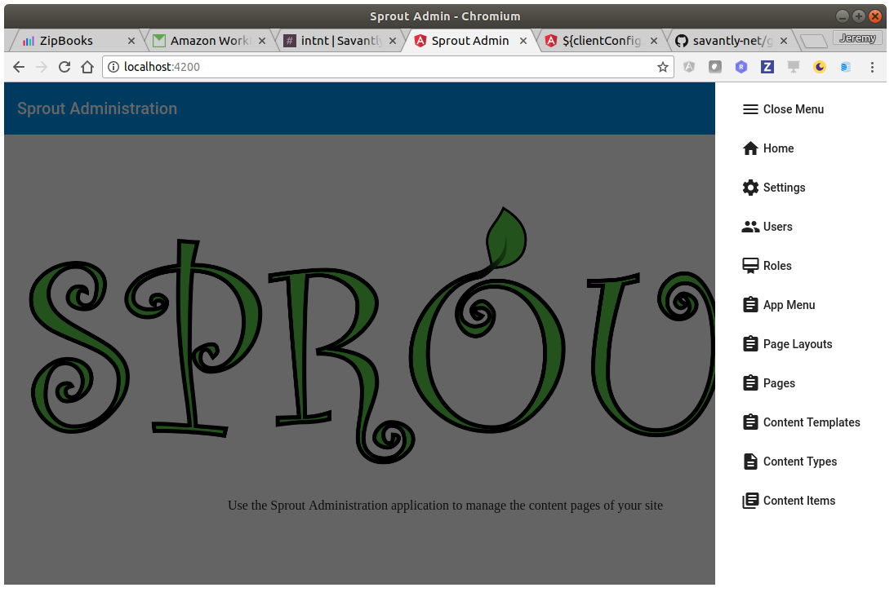  

### Settings Page
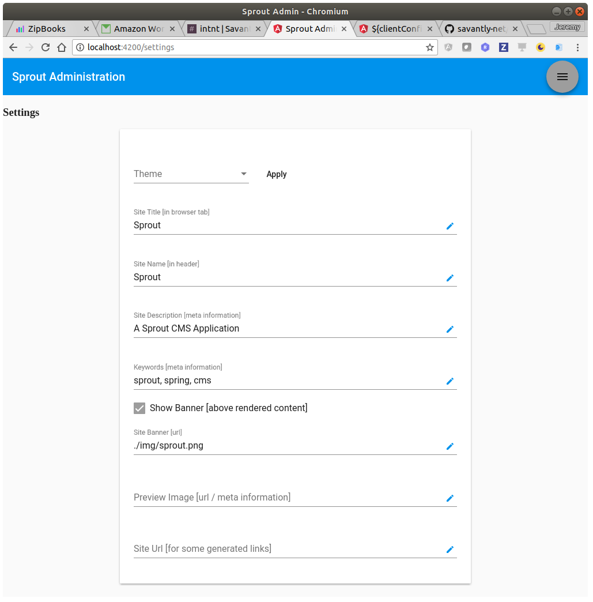  

#### Menu Admin Page  
Manage the menu for your Sprout application  
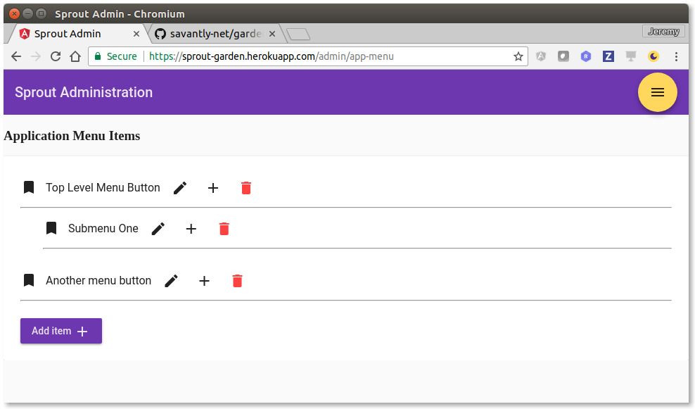  
You can browse your pages to create navigation links.  
The icon name is a ligature reference to the [Material Icons]. If the ligature name is invalid, it will default to the text content.  
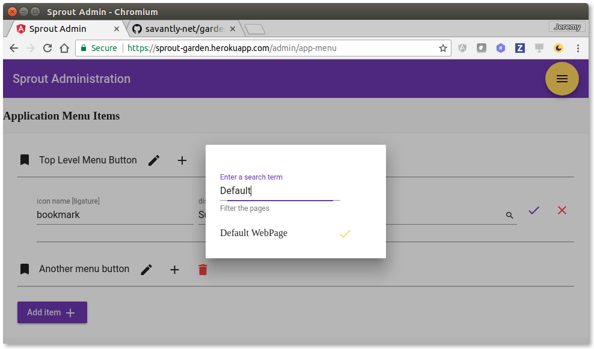  

#### ContentType Admin Page  
Manage the Content Types for your Sprout application.  
A Content Type is a 'definition' for a Content Item.  
Think of it as a 'recipe'.  
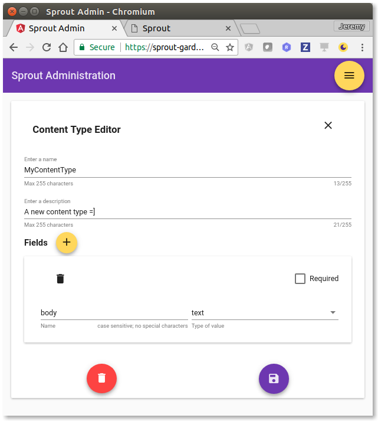  

#### ContentTemplate Admin Page  
Manage the Content Templates for your Sprout application.  
A Content Item will reference a Content Template, for instructions on how to render.  
The template uses [Freemarker] syntax.  
The template should include the targeted field names of a Content Type.  
For example, the demo Content Type includes a field named 'body'. So when an instance [Content Item] of the demo Content Type is rendered using this template, the value of the field is inserted into the template at the specified location.  
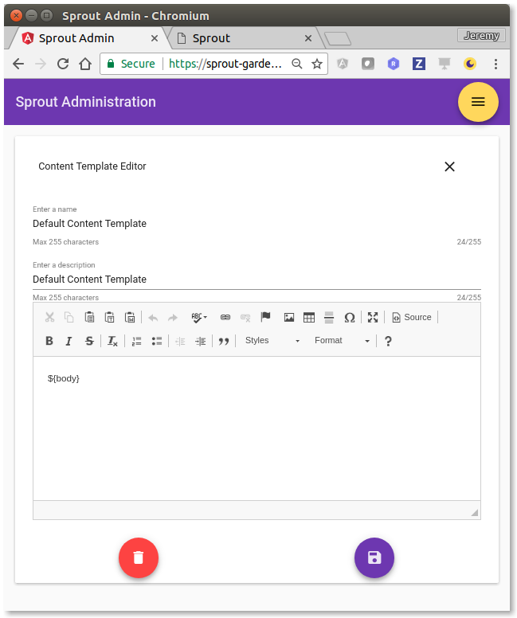  

#### ContentItem Admin Page  
Manage the Content Items for your Sprout application.  
The Content Item is an instance of a Content Type.  
The Content Item is rendered by the selected Content Template.  
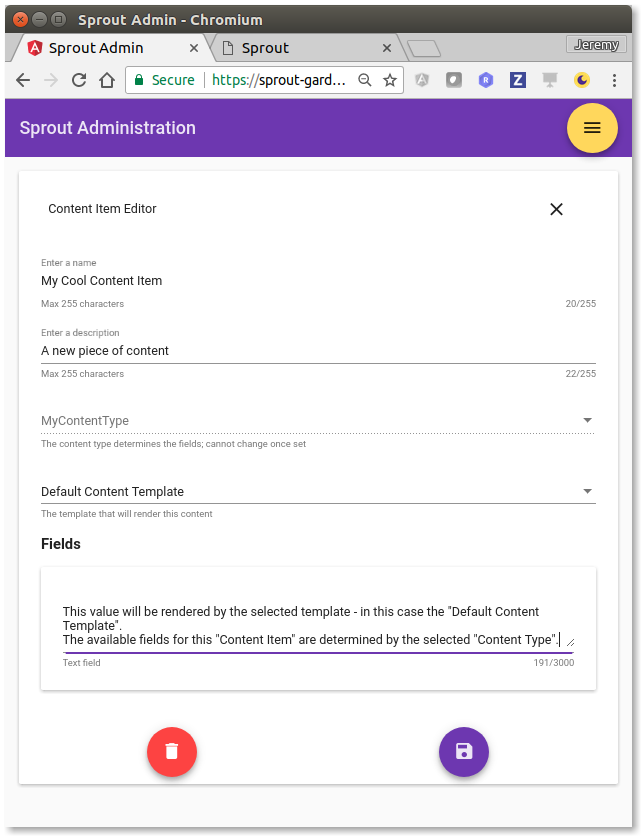  

#### PageLayout Admin Page  
Manage the Page Layouts for your Sprout application.  
The Page Layout is the definition for a Page.  
Similar to the Content Template, the placeholders in the Page Layout are replaced by values from a Page instance. 
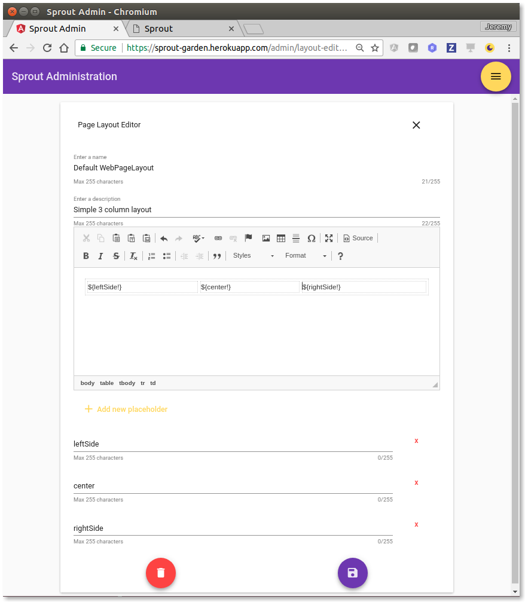  

#### Page Admin Page  
Manage the Pages for your Sprout application.  
A Page item is an instance of a Page Layout.  
Content Items are added to the placeholders, and rendered using the Page Layout definition.   
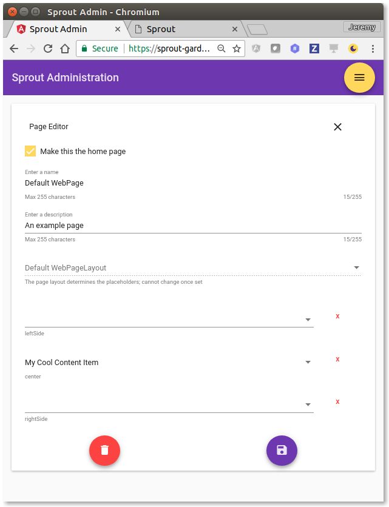  

#### Example Rendered page   
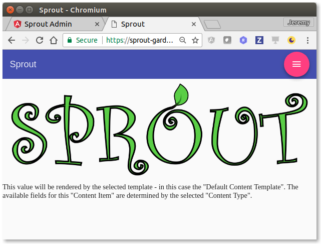  

[release]: https://github.com/savantly-net/garden/releases  
[Garden App]: https://github.com/savantly-net/garden  
[sprout-spring-boot-starter]: https://github.com/savantly-net/sprout-platform/tree/master/spring/sprout-spring-boot-starter  
[Material Icons]: https://material.io/icons/  
[Freemarker]: http://freemarker.org/
