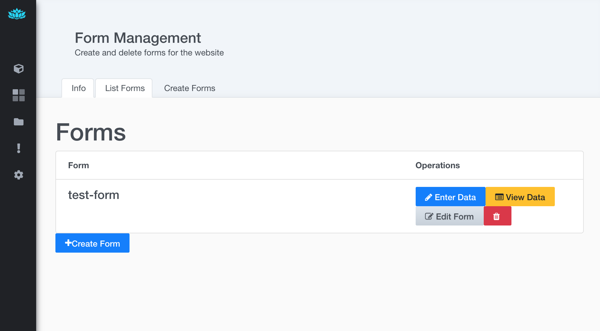
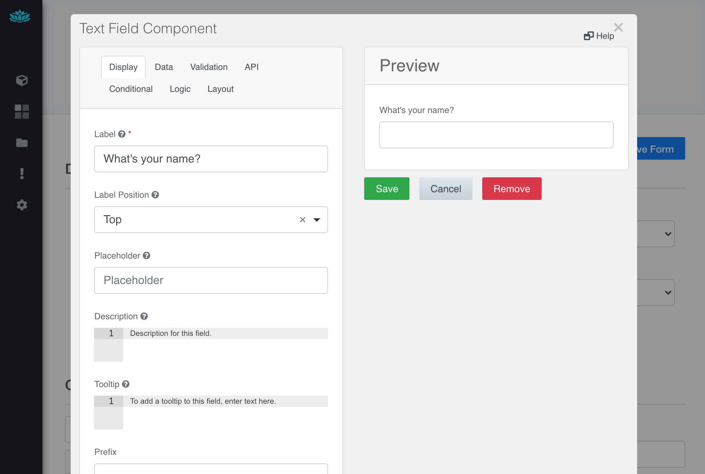
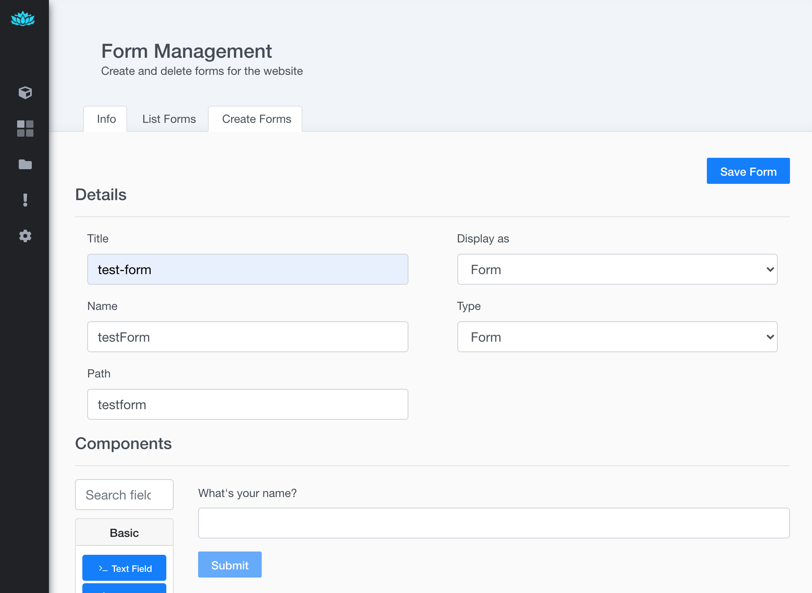
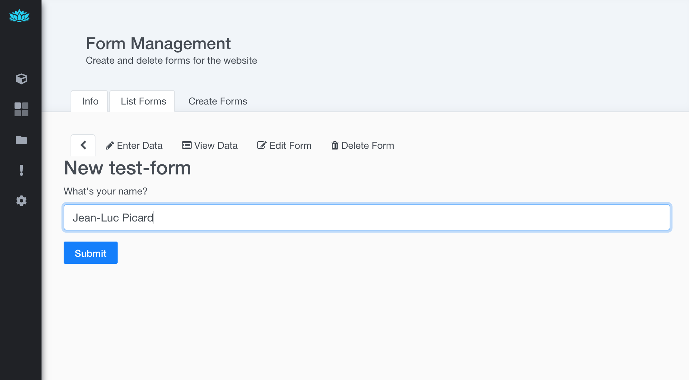
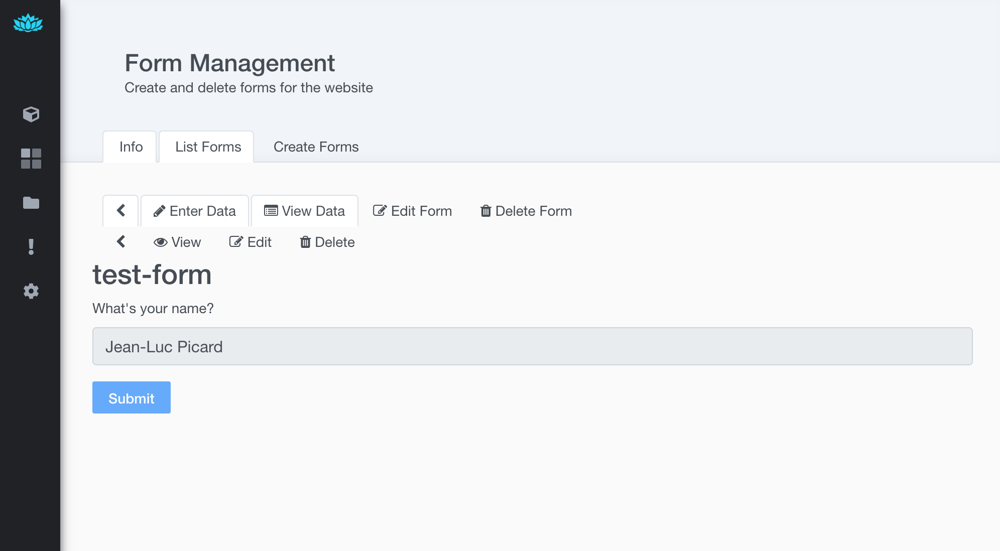
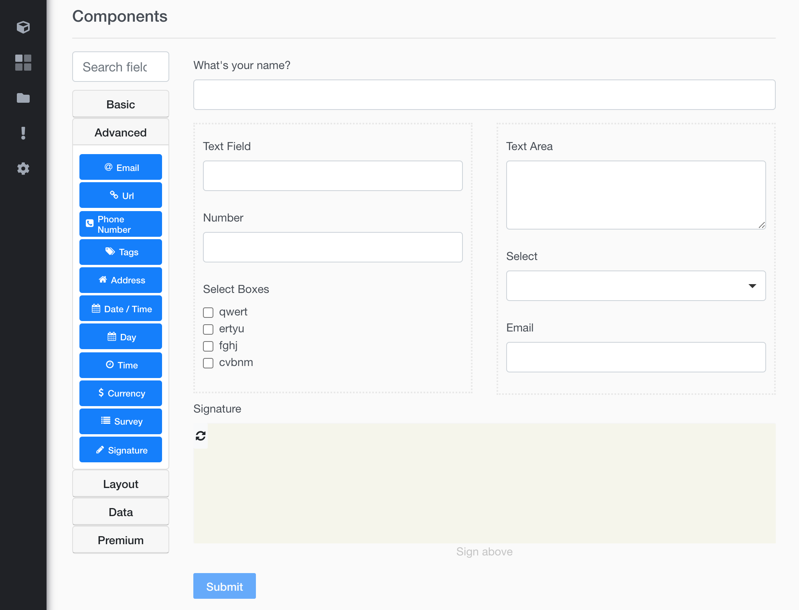
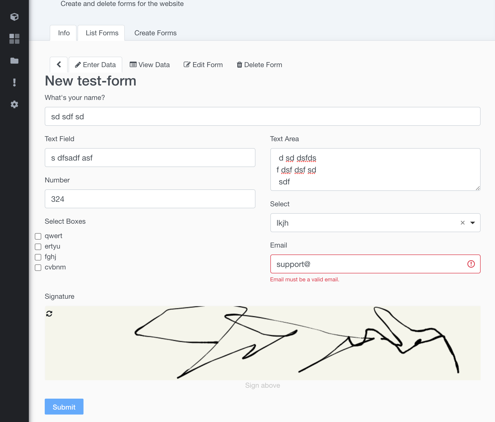

# Forms Module for Sprout

A Sprout Module that provides Form Management.  

This library uses the Formio React library, and implements a partial Formio server in Java.


## Dev Quickstart
Checkout the source code, and from the project root -  
Start the DB using Docker Compose *or* `rush start:db`    

```
docker compose -f backend/server/docker-compose.yml up 
```

- start the dev sprout server  
`./gradlew :sprout-modules-forms:bootRun`
  
The server is now running on `localhost:8080`  

To continuously compile for application live-reload, start in another terminal session    
`./gradlew :sprout-modules-forms:compileJava --continuous`


- start the dev web server -  
`rush start`  
The web server is now running on `localhost:3000`  

- optionally start watching the client side code for changes  
- `cd backend/modules/forms/`
- `yarn watch`  

If client code changes are made, the files are re-packed and the sprout test server makes them immediately available, so you may just refresh the browser to see the updates.  


## Docker 
You can start a fully functional platform by using the included docker-compose.yml file.  
First build the module -  
`.gradlew :sprout-modules-forms:build`  

The build jar file is mounted in the sprout server through a docker volume -  
`./build/lib/<module>.jar`  

The following services are available -  

| Service | Location |
|- |- |
| Posgres | localhost:5432|
| Sprout Server | http://localhost:8080 |
| Sprout Web | http://localhost:3000 |
| Adminer [DB UI] | http://localhost:8081 |


## Screenshots  

List Forms -  
  

Edit Field -  
  

Edit Form -  
  

Enter Data -  
  

View Data -  
  

Edit Form Complex -  
  

Enter Data Complex -  
  
