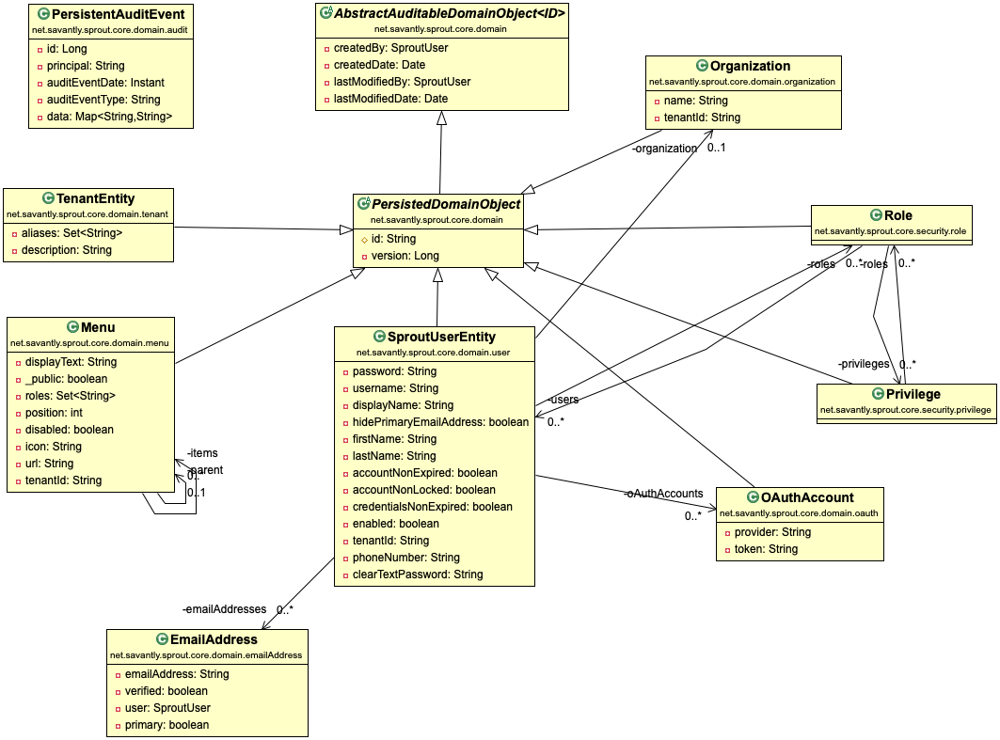

# sprout-core
Core Sprout library

Provides the core domain entities for the Sprout platform.  

## SproutUser
Implementation of the Spring UserDetails + rich methods for managing a user.  
[More Info](./src/main/java/net/savantly/sprout/core/domain/user/SproutUser.java)  

## PersistentAuditEvent
Event record for domain entity changes.  
[More Info](./src/main/java/net/savantly/sprout/core/domain/audit/PersistentAuditEvent.java)  

## EmailAddress

A record describing a user's email address. Contains information if it's `verified` or the `primary` email address.  
[More Info](./src/main/java/net/savantly/sprout/core/domain/emailAddress/EmailAddress.java)  

## Menu
A menu item that can be used on the client to build menu structures. A menu item can have a parent menu item and multiple children.   
[More Info](./src/main/java/net/savantly/sprout/core/domain/menu/Menu.java)  

## MetaDataContainer
Domain objects that implement the `MetaDataContainer` interface can hold additional data that may be useful on the client, especially for rendering evaluation.    
[More Info](./src/main/java/net/savantly/sprout/core/domain/metadata/MetaDataContainer.java)   

## OAuthAccount
An OAuth account that has been associated to a user.   
[More Info](./src/main/java/net/savantly/sprout/core/domain/oauth/OAuthAccount.java)

## Organization 
A user can be associated to a particular organization.    
[More Info](./src/main/java/net/savantly/sprout/core/domain/organization/Organization.java)   

## Tenant [TenantSupport]
A record that is used to associate entities to a specific 'tenancy'.  
A domain entity may implement the [TenantSupport](./src/main/java/net/savantly/sprout/core/domain//TenantSupport.java) interface to be considered for tenant evaluation. For example, the sprout-spring-boot-starter uses the host name header in a web request to determine the appropriate tenant, and filter entities based on this value.      
[More Info](./src/main/java/net/savantly/sprout/core/domain/tenant/Tenant.java)   

## TenantedPersistedDomainObject
A domain entity may extend the `TenantedPersistedDomainObject` abstract class for easier configuration of tenant aware entities.  
This class implements the required tenancy filter.  
The tenancy filter can be definined on entities that don't extend this class, but the repository should still be a `TenantedJpaRepository`.  
The entity also needs to implement `TenantSupport`, and should implement the `@PrePersist` hook to make sure the tenantId is set before saving.

## TenantedJpaRepository
Only `TenantedJpaRepository` are considered for tenancy filtering. Use this as the repository interface for any entity that should be filtered.  
 

# Security 

## SproutPermissionEvaluator

Implement an evaluator bean for a specific domain entity type to manage granular authorization.     
[More Info](./src/main/java/net/savantly/sprout/core/security/SproutPermissionEvaluator.java)  

## SproutPermissionRegistry
All the bean implementations of `SproutPermissionEvaluator` are automatically registered here.     
[More Info](./src/main/java/net/savantly/sprout/core/security/SproutPermissionRegistry.java)  

## DelegatingPermissionEvaluator
Delegates permission evaluation to the `SproutPermissionEvaluator` implementation associated with the target domain object.     
[More Info](./src/main/java/net/savantly/sprout/core/security/DelegatingPermissionEvaluator.java)  

## Privilege
A record that can be used to identify a granular privilege/permission to perform an action.     
[More Info](./src/main/java/net/savantly/sprout/core/security/privilege/Privilege.java)  

## Role
A user is associated to multiple `roles` which are associated to multiple `privileges`.  
Roles are a way to group privileges together for easier authorization management.     
[More Info](./src/main/java/net/savantly/sprout/core/security/role/Role.java)  

# Domain Diagram

