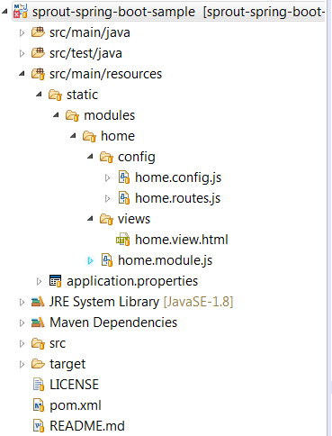

# sprout-spring-boot-starter  

Opinionated auto-configuration library that constructs a "single page application" [SPA] framework for your custom spring-boot app.  

## Installation 
Include the artifact in your Spring-Boot project -  

	<dependency>
		<groupId>net.savantly.sprout</groupId>
		<artifactId>sprout-spring-boot-starter</artifactId>
		<version>0.0.1-RELEASE</version>
	</dependency>

Start your Spring-Boot application, and the SPA framework is created like MAGIC!  

Check out the [sample application](https://github.com/savantly-net/sprout-spring-boot-sample)  

  

You can customize the Sprout starter with properties or providing your own implementation of the  [SproutControllerConfiguration](./src/main/java/net/savantly/sprout/autoconfigure/controller/SproutControllerConfiguration.java)  

## Sprout Module Format  
Create Sprout modules in your Spring-Boot app easily, and they are automatically registered on the client side - 
  

The Sprout Core js includes Authentication and Menu services to make rapid prototyping. [Example Module](https://github.com/savantly-net/sprout-spring-boot-sample/tree/master/src/main/resources/static/modules/home)

## Properties 

	### Custom property map that is exposed in the client side app
	savantly.sprout.controller.config.customProp1=customValue1
	savantly.sprout.controller.config.customProp2=123
	
	### Where your client side code is located
	### Uses the "src/main/resources/static" location by default
	savantly.sprout.controller.resourcePrefix="classpath:"
	savantly.sprout.controller.resourcePath="/static/"
	savantly.sprout.controller.modulesFolder="modules"
	
	### Sprout core files can be overridden if you want to provide a custom header or footer.
	### Note - this is imported with an angular directive
	savantly.sprout.controller.headerView="'sprout/core/views/header.view.html'"
	savantly.sprout.controller.footerView="'sprout/core/views/footer.view.html'"
	savantly.sprout.controller.footerText="<b>Sprout</b> by <a href=\"http://savantly.net\" target=\"_blank\">Savantly.net</a>"
	
	### Configure your Spring Security authentication URLs for automatic wiring
	savantly.sprout.controller.logoutUrl="/logout"
	savantly.sprout.controller.loginUrl = "/login"
	
	### Add your own JS libs to inject into the index page.
	### These can be local or remote
	savantly.sprout.controller.jsLibs[0]="http://example.com/test.js"
	savantly.sprout.controller.jsLibs[1]="/test.js"
	
	### Add your own css libs to inject into the index page.
	### These can be local or remote
	savantly.sprout.controller.cssLibs[0]="http://example.com/test.css"
	savantly.sprout.controller.cssLibs[1]="/test.css"
	
	
	######### Advanced #########
	### Override the core libs if you prefer a different version of Angular or other dependencies
	savantly.sprout.controller.jsCoreLibs[0]="./angular-old.js"
	savantly.sprout.controller.cssCoreLibs[0]="./different-theme.css"
	savantly.sprout.controller.jsCoreSearchPatterns[0]="*/*.js"
	savantly.sprout.controller.jsModuleSearchPatterns[0]="./different-location/**/*.js"
	savantly.sprout.controller.cssModuleSearchPatterns[0]="./different-location/**/*.css"
